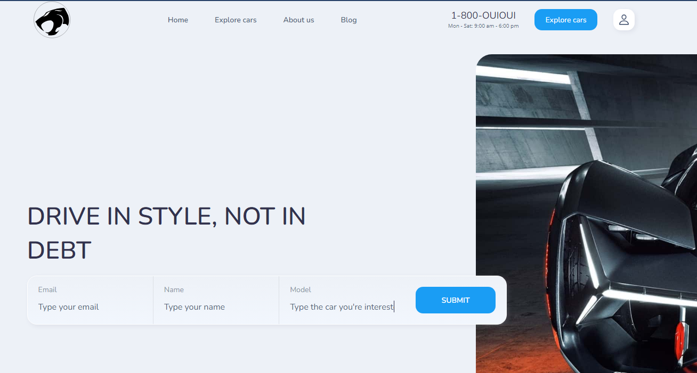

<h2 align="center">ThunderCats Project 3</h2>

This repo contains the necessary files to deploy a basic web application using AWS Amplify.

 

### Prerequisites
1. This code requires the use of:
    -AWS Amplify to host the website
    -DynamoDB Table to store our data
    -Lambda function to add data to DB table (Python 3.8 runtime)
    -API Gateway to interact with the Lambda Function.

2. There are support files included in the setupFiles folder that include:
    -the lambda code
    -a provisioning playbook in YAML for CloudFormation
    -permissions for the Lambda function (to be added to the Lambda execution role)
    